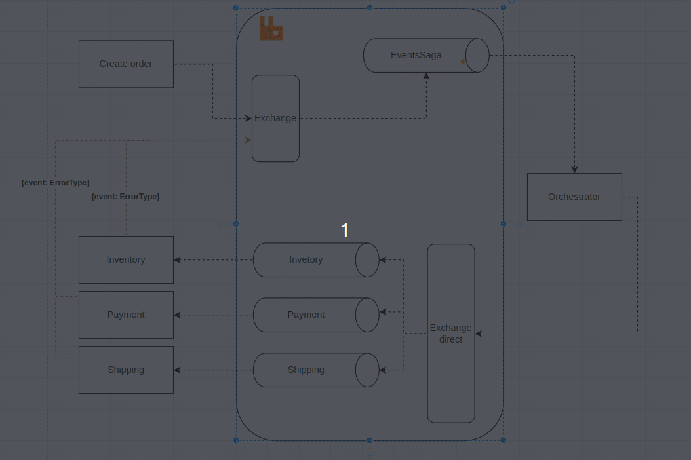

Esse projeto é para estudar o padrão saga do tipo orquestrado usando rabbitmq com broker, como demostra o diagrama a baixo

This project is to study the orchestrated type of the Saga pattern using RabbitMQ with a broker, as demonstrated in the diagram below.

